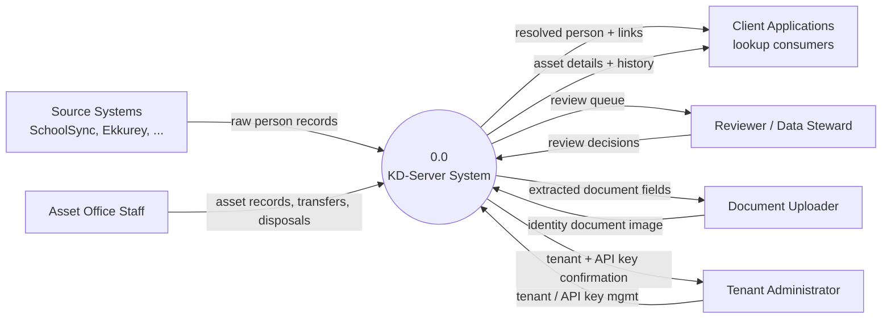
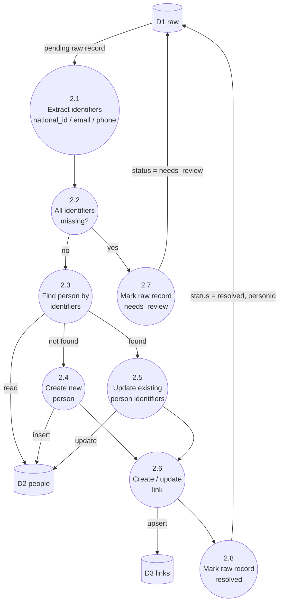
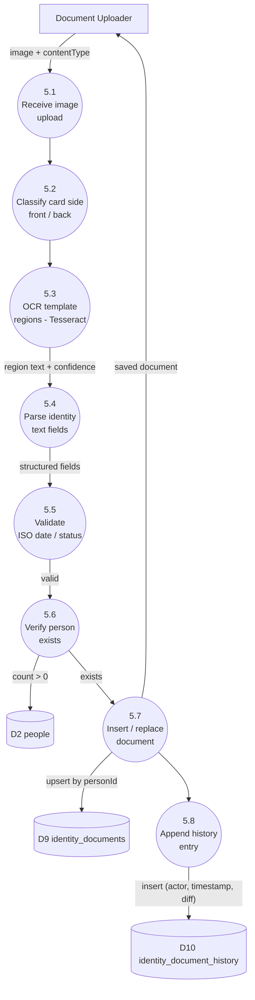
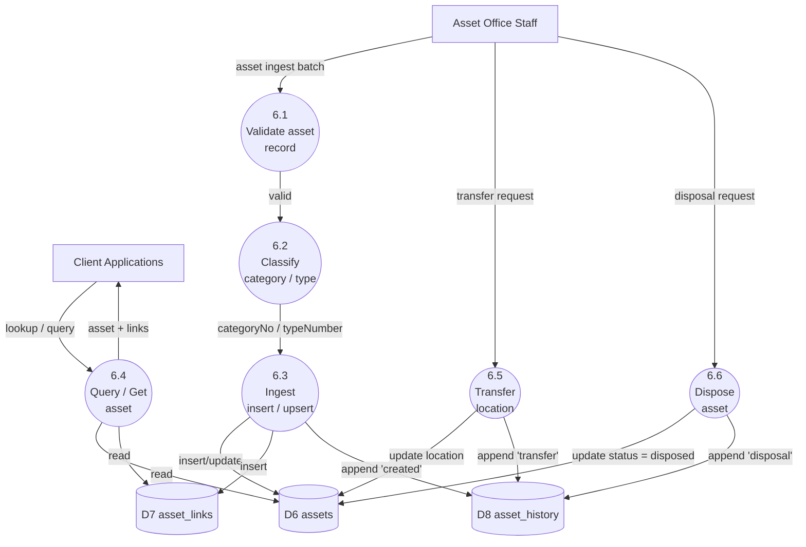

# Data Flow Diagrams — KD-Server

Leveled DFD (0 → 1 → 2) for the KD-Server multi-tenant identity resolution backend, generated from the current codebase (`internal/http`, `internal/services`, `internal/store`).

## Notation

Diagrams are drawn with [Mermaid](https://mermaid.js.org) flowcharts using **Yourdon–DeMarco** convention:

| Shape | Meaning |
|---|---|
| `[Name]` rectangle | External entity (outside the system) |
| `(( N.0 Name ))` circle | Process |
| `[(D# name)]` cylinder | Data store (MongoDB collection) |
| Arrow label | Data flowing between them |

Classic Yourdon–DeMarco draws a data store as an open-ended rectangle (two horizontal lines, open on the right). Mermaid's widely-supported classic syntax has no such primitive, so a cylinder is used as the closest safely-renderable substitute — it reads unambiguously as "storage" even though it's borrowed from ER-diagram notation.

All processes are implicitly scoped by `tenantId` — every read/write is filtered to the tenant resolved from the `X-KD-Tenant` header + bearer token (API key or JWT), enforced by `authMiddleware` (`internal/http/server.go`). This cross-cutting check is omitted from the diagrams below for readability and called out once here instead.

---

## Level 0 — Context Diagram

The system as a single process, showing every external entity that sends or receives data.

---

## Level 1 — System Processes

Decomposes the system into its major processes and the data stores (MongoDB collections) each one touches.

```mermaid
flowchart TB
    SRC[Source Systems]
    ASSETOFF[Asset Office Staff]
    CLIENT[Client Applications]
    REVIEWER[Reviewer]
    DOCUPLOAD[Document Uploader]
    TENANTADMIN[Tenant Administrator]

    P1((1.0<br/>Ingest))
    P2((2.0<br/>Resolve))
    P3((3.0<br/>Lookup))
    P4((4.0<br/>Review))
    P5((5.0<br/>Identity Document<br/>Extraction))
    P6((6.0<br/>Asset Management))
    P7((7.0<br/>Tenant / API Key<br/>Administration))

    D1[(D1 raw)]
    D2[(D2 people)]
    D3[(D3 links)]
    D4[(D4 tenants)]
    D5[(D5 keys)]
    D6[(D6 assets)]
    D7[(D7 asset_links)]
    D8[(D8 asset_history)]
    D9[(D9 identity_documents)]
    D10[(D10 identity_document_history)]
    D11[(D11 sources)]

    SRC -- "POST /v1/ingest" --> P1
    P1 -- "insert pending" --> D1
    P1 -- "upsert source metadata" --> D11

    P2 -- "read pending" --> D1
    P2 -- "match / create" --> D2
    P2 -- "create / update" --> D3
    P2 -- "update status" --> D1

    CLIENT -- "GET /v1/lookup/{phone,email}" --> P3
    P3 -- "read" --> D2
    P3 -- "read" --> D3
    P3 -- "unified person + links" --> CLIENT

    REVIEWER -- "GET /v1/review, POST decision" --> P4
    P4 -- "read needs_review" --> D1
    P4 -- "update status" --> D1
    P4 -- "queue" --> REVIEWER

    DOCUPLOAD -- "POST identity document image" --> P5
    P5 -- "verify person exists" --> D2
    P5 -- "insert/replace document" --> D9
    P5 -- "append history" --> D10
    P5 -- "extracted fields" --> DOCUPLOAD

    ASSETOFF -- "ingest / transfer / dispose" --> P6
    P6 -- "read/write" --> D6
    P6 -- "read/write" --> D7
    P6 -- "append" --> D8
    P6 -- "confirmation + history" --> ASSETOFF
    CLIENT -- "GET /v1/lookup/asset, /v1/assets" --> P6

    TENANTADMIN -- "create tenant, issue/revoke key" --> P7
    P7 -- "read/write" --> D4
    P7 -- "read/write (hashed)" --> D5
    P7 -- "tenant + key summary" --> TENANTADMIN
```

---

## Level 2 — Process Decompositions

### 2.0 Resolve (deterministic matching)

`internal/services/resolve.go` — the core dedup logic.

### 5.0 Identity Document Extraction

`internal/services/document_extraction.go` + `identity_document.go` — OCR pipeline for Maldivian ID cards.

### 6.0 Asset Management

`internal/services/asset.go` — asset lifecycle (ingest → classify → transfer/dispose).

---

## Data Store Reference

| ID | Collection | Purpose | Key Fields |
|---|---|---|---|
| D1 | `raw` | Ingested records awaiting resolution | `tenantId`, `sourceSlug`, `payload`, `status`, `personId` |
| D2 | `people` | Resolved person entities | `tenantId`, `personId`, `nationalId`, `primaryEmail`, `primaryPhone` |
| D3 | `links` | Person ↔ source-record connections | `tenantId`, `personId`, `source`, `externalId` |
| D4 | `tenants` | Tenant definitions | `slug`, `name` |
| D5 | `keys` | Hashed API keys per tenant | `tenantId`, `keyId`, `keyHash`, `revokedAt` |
| D6 | `assets` | Physical/fixed asset records | `tenantId`, `assetNo`, `categoryNo`, `typeNumber`, `status`, `location` |
| D7 | `asset_links` | Asset ↔ source-record connections | `tenantId`, `assetNo`, `source`, `externalId` |
| D8 | `asset_history` | Audit trail of asset lifecycle events | `assetNo`, `action`, `performedBy`, `notes` |
| D9 | `identity_documents` | Identity documents linked to a person | `tenantId`, `personId`, extracted fields, `verificationStatus` |
| D10 | `identity_document_history` | Audit trail of identity document changes | `personId`, `actor`, `changedAt` |
| D11 | `sources` | Upsert-tracked metadata about ingest sources | `tenantId`, `sourceSlug`, last-seen batch info |

---

## Notes

- Every process in Level 1/2 sits behind `authMiddleware`, which requires `X-KD-Tenant` + `Authorization: Bearer <token>` (either a `key_`-prefixed API key verified against D5, or an HS256 JWT with a matching `tenant` claim) — see `internal/http/server.go:173`.
- The Admin/Tenant Administration process (7.0) uses a **separate** auth path (`internal/http/admin_auth.go`, username/password session) since it manages the credentials the other processes depend on.
- This document reflects the codebase as of commit `700eba8` (2026-07-11). Regenerate/update when new processes or collections are added — one PR per roadmap part, per `CLAUDE.md`.
